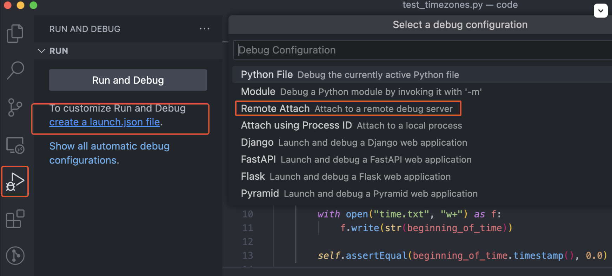
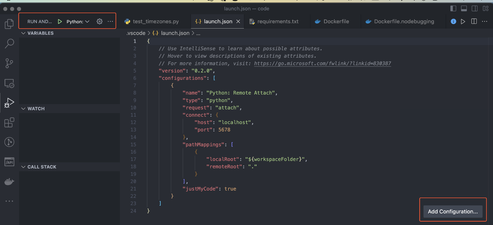

local setup to replicate this video
https://www.youtube.com/watch?v=qCCj7qy72Bg&t=8s

**Part A: Initial setup**

From code folder in terminal:

steps to install/run locally and verify failing tests

1. pip3 install -r requirements.txt
2. python3 -m unittest

steps to build and run docker container and verify successful tests (or see below to name image as part of build and run)

1. docker build .
2. docker run [image sha] unittest

OR

1. docker build . -t debug-docker
2. docker run debug-docker unittest

**Part B: change entrypoint to longer running process to debug interactively**

1. docker run -i -d --entrypoint=bash debug-docker (will return the sha that will be needed in step 3)
2. docker ps will show that this container is still running
3. docker exec -it 8f6d4726a857 bash (where 8f... is the SHA returned in step 1 - it's also displayed in step 2 [docker ps])
4. type "python3" to start doing pythony things and poke around
5. exit() to exit python and exit to exit docker exec

**Part C: copy files to/from host**

1. add some code into the test to ouput a text file showing the value of the time variable

```python

        with open("time.txt", "w+") as f:
            f.write(str(beginning_of_time))

```

2. run locally (as before: python3 -m unittest)
3. rebuild image (as before: docker build . -t debug-docker)
4. run docker image with altered entrypoint (as before: docker run -i -d --entrypoint=bash debug-docker)
5. as before, exec into the container (run `ls` and see there is a gotcha here - since you ran it locally, a time.txt has been copied across with everything else - see next step to remove it)
6. `rm time.txt`
7. `python3 -m unittest`
8. can now look at time.txt by `cat`-ting it out (err it looks the same as my local one though)
9. anyway let's learn about copying it.. first we have to `exit`
10. cp source then destination like this 'docker cp d095:/src/time.txt ./time.txt.fromcontainer` so we never really needed to exec in prior btw

**run a debugger inside the container and connect to it from the host system**

add stages to dockerfile so we can build normally (primary) or with debugger

replace

```python
ENTRYPOINT ["python","-m"]
```

with

```python
FROM base as debugger

RUN pip install debugpy

ENTRYPOINT ["python","-m","debugpy","--listen","0.0.0.0:5678","--wait-for-client","-m"]

FROM base as primary

ENTRYPOINT ["python","-m"]
```

now we will build the image - remember before we did so like this:
`docker build . -t debug-docker` so this time we will do so like this
`docker build --target=debugger . -t debug-docker`

now we will run `docker run -p 5678:5678 debug-docker unittest` and we will notice that the process does not exit and return to our shell - it's waiting for the debugger

so let's look at how to set up vscode for python debugging - this might help - https://code.visualstudio.com/docs/python/debugging and note it refers to here which is a required extension to install https://code.visualstudio.com/docs/python/python-tutorial#_configure-and-run-the-debugger

I may add some images to show how we set up the launch.json to attach to remote debugger




Now we are going to add a breakpoint in the code - like debugger; but in python it's breakpoint() then rebuild the docker container and run it this way again

`docker build --target=debugger . -t debug-docker`
`docker run -p 5678:5678 debug-docker unittest`
command shift d to open up 'run and debug' in vscode
